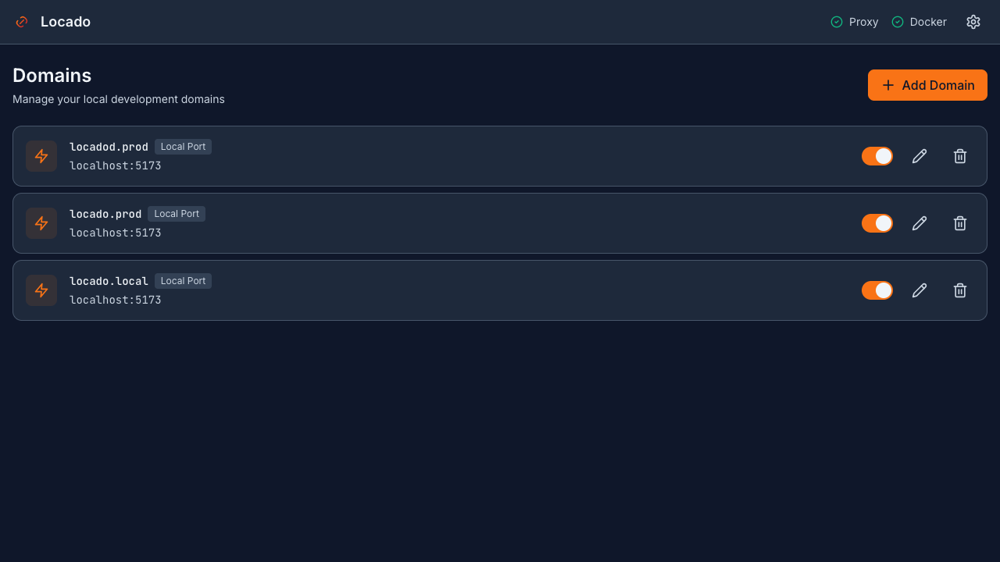

<p align="center">
  <h1 align="center">Locado</h1>
  <p align="center">
    <strong>Local Domain Manager</strong><br>
    Beautiful domains for local development
  </p>
</p>

<p align="center">
  <a href="https://github.com/xuandung38/locado/releases/latest">
    
  </a>
  <a href="https://github.com/xuandung38/locado/releases">
    
  </a>
  <a href="LICENSE">
    
  </a>
</p>

<p align="center">
  <a href="README.vi.md">🇻🇳 Tiếng Việt</a>
</p>

<p align="center">
  
</p>

---

## Features

- 🌐 **Custom Local Domains** - Map `myapp.local` → `localhost:3000`
- 🔒 **Automatic HTTPS** - Local SSL certificates, trusted by your browser
- 🐳 **Docker Support** - Proxy to containers by name
- 🌍 **Remote Hosts** - Forward to remote servers
- 🖥️ **Web Dashboard** - Beautiful UI for managing domains
- ⚡ **Zero Config DNS** - Automatic DNS resolution

## Quick Install

```bash
curl -fsSL https://locado.hxd.app/install.sh | bash
```

Or download directly from [Releases](https://github.com/xuandung38/locado/releases).

## Usage

```bash
# Start server (requires sudo for ports 80/443)
sudo locado

# Open dashboard
open http://localhost:2280
```

## Requirements

- **macOS** 10.15+ or **Linux** (Ubuntu, Debian, Fedora, etc.)
- Ports **80** and **443** must be available
- *(Optional)* Docker for container support

## Commands

| Command | Description |
|---------|-------------|
| `locado` | Start the server |
| `locado server` | Start server (explicit) |
| `locado update check` | Check for updates |
| `locado update changelog` | Show latest changelog |
| `locado uninstall` | Remove Locado from system |

## How It Works

```
┌──────────────┐     ┌─────────────┐     ┌──────────────┐
│   Browser    │────▶│   Locado    │────▶│ Your Service │
│ myapp.local  │     │   Proxy     │     │ localhost:3000│
└──────────────┘     └─────────────┘     └──────────────┘
```

1. **DNS Resolution** - Locado configures your system to resolve `.local` domains to `127.0.0.1`
2. **Reverse Proxy** - Incoming requests are routed to your local services
3. **TLS Termination** - Automatic HTTPS with locally-trusted certificates

## Configuration

Domains are managed through the web dashboard at `http://localhost:2280`.

Each domain can target:
- **Local Port** - Forward to `localhost:PORT`
- **Docker Container** - Forward to a running container
- **Remote Host** - Forward to an external server

## Troubleshooting

### Port 80/443 already in use

Stop any conflicting services:
```bash
# macOS
sudo lsof -i :80
sudo lsof -i :443

# Stop the process or use a different port
```

### DNS not resolving

Locado uses dnsmasq for DNS. If domains don't resolve:
```bash
# Check dnsmasq status
brew services list | grep dnsmasq  # macOS
systemctl status dnsmasq           # Linux
```

## Author

**Hồ Xuân Dũng**

- 🌐 Website: [hxd.vn](https://hxd.vn)
- 📧 Email: [me@hxd.vn](mailto:me@hxd.vn)
- 💻 GitHub: [@xuandung38](https://github.com/xuandung38)

## License

Locado is **free to use** for personal and commercial projects.

Source code is proprietary. See [LICENSE](LICENSE) for details.

---

<p align="center">
  Made with ❤️ by <a href="https://hxd.vn">Hồ Xuân Dũng</a>
</p>
